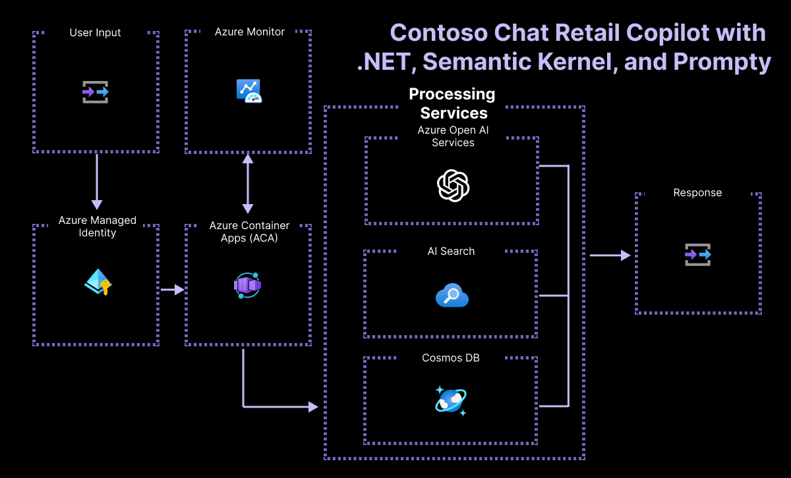

# Contoso Chat Retail with .NET and Semantic Kernel

Samples in JavaScript, Python, and Java. Learn more at https://aka.ms/azai.

---

# Table of Contents

- [What is this sample?](#what-is-this-sample)
- [Features](#features)
- [Architecture Diagram](#architecture-diagram)
- [Getting Started](#getting-started)
  - [Prerequisites](#prerequisites)
  - [Quickstart](#quickstart)
- [Security Guidelines](#security-guidelines)
- [Resources](#resources)

[](https://github.com/codespaces/new?hide_repo_select=true&ref=main&repo=599293758&machine=standardLinux32gb&devcontainer_path=.devcontainer%2Fdevcontainer.json&location=WestUs2)
[](https://vscode.dev/redirect?url=vscode://ms-vscode-remote.remote-containers/cloneInVolume?url=https://github.com/Azure-Samples/chat-rag-openai-csharp-prompty) 

# What is this sample?

In this sample, we present **Contoso Outdoors**, a conceptual store specializing in outdoor gear for hiking and camping enthusiasts. This virtual store enhances customer engagement and sales support through an intelligent chat agent. This agent is powered by the **Retrieval Augmented Generation (RAG)** pattern within the **Microsoft Azure AI Stack**, enriched with **Semantic Kernel** and **Prompty** support.

Artificial Intelligence integrates into the customer service experience, offering responses that are not only relevant but also personalized, drawing from the extensive product catalog and individual customer purchase histories.

For our web application, we are using **.NET Stack**, and **AZD**, for an easy and quick deploy.

This sample uses the [Azure AI](https://azure.microsoft.com/solutions/ai/). It leverages **Azure OpenAI** to our chat features and **Semantic Kernel** to manage and insert the prompt into our code, and to evaluate prompt/LLM performance.

**Contoso Chat .NET** shows you how to:

1. Build a retail copilot application using the **RAG pattern**.
2. Ideate & iterate on application using [**Semantic Kernel**](https://learn.microsoft.com/en-us/semantic-kernel/overview/?tabs=Csharp) and **Prompty**.
3. Build & manage the solution using the **Azure AI platform & tools**.
4. Provision & deploy the solution using the [**Azure Developer CLI**](https://learn.microsoft.com/en-us/azure/developer/azure-developer-cli/overview).
5. Support **Responsible AI** practices with evaluation & content safety.


# Features

The project comes with:

- Sample **model configurations**, **evaluation prompts**, and **Prompty** assets (to simplify prompt creation & iteration) for a RAG-based copilot application
- Sample **product and customer data** for retail application scenario
- Sample **application code** for copilot chat and evaluation functions
- Sample **azd-template configuration** for managing application on Azure

*This sample does not come with a front-end we recommend integrating it with the following front-end template:* 
- [https://github.com/Azure-Samples/web-openai-swa-frontend](https://github.com/Azure-Samples/web-openai-swa-frontend)

The sample is also a signature application for demonstrating the new capabilities of the Azure AI platform. Expect regular updates to showcase cutting-edge features and best practices for generative AI development. 

## Architecture Diagram


# Getting Started

## Prerequisites

### Azure Account 

**IMPORTANT:** In order to deploy and run this example, you'll need:

* **Azure account**. If you're new to Azure, [get an Azure account for free](https://azure.microsoft.com/free/cognitive-search/) and you'll get some free Azure credits to get started. See [guide to deploying with the free trial](docs/deploy_lowcost.md).
* **Azure subscription with access enabled for the Azure OpenAI service**. You can request access with [this form](https://aka.ms/oaiapply). If your access request to Azure OpenAI service doesn't match the [acceptance criteria](https://learn.microsoft.com/legal/cognitive-services/openai/limited-access?context=%2Fazure%2Fcognitive-services%2Fopenai%2Fcontext%2Fcontext), you can use [OpenAI public API](https://platform.openai.com/docs/api-reference/introduction) instead. Learn [how to switch to an OpenAI instance](docs/deploy_existing.md#openaicom-openai).
    - Ability to deploy these models - `gpt-35-turbo`, `gpt-4`, `text-embeddings-ada-002`
    - We recommend using Sweden Central or East US 2
* **Azure account permissions**:
  * Your Azure account must have `Microsoft.Authorization/roleAssignments/write` permissions, such as [Role Based Access Control Administrator](https://learn.microsoft.com/azure/role-based-access-control/built-in-roles#role-based-access-control-administrator-preview), [User Access Administrator](https://learn.microsoft.com/azure/role-based-access-control/built-in-roles#user-access-administrator), or [Owner](https://learn.microsoft.com/azure/role-based-access-control/built-in-roles#owner). If you don't have subscription-level permissions, you must be granted [RBAC](https://learn.microsoft.com/azure/role-based-access-control/built-in-roles#role-based-access-control-administrator-preview) for an existing resource group and [deploy to that existing group](docs/deploy_existing.md#resource-group).
  * Your Azure account also needs `Microsoft.Resources/deployments/write` permissions on the subscription level.
- **Ability to provision Azure AI Search (Paid)** - Required for Semantic Ranker
    - We recommend using East US 2    
- **Ability to provision Azure Monitor (Free tier)**
- **Ability to deploy to Azure Container Apps (Free tier)**

### AZD
- **Install [azd](https://aka.ms/install-azd)**
    - Windows: `winget install microsoft.azd`
    - Linux: `curl -fsSL https://aka.ms/install-azd.sh | bash`
    - MacOS: `brew tap azure/azd && brew install azd`


## Deploy

### Step 1: Development Environment

The repository is instrumented with a devcontainer.json configuration that can provide you with a pre-built environment that can be launched locally, or in the cloud. You can also elect to do a manual environment setup locally, if desired. Here are the three options in increasing order of complexity and effort on your part. 

Pick one!

- Pre-built environment, in cloud with GitHub Codespaces
- Pre-built environment, on device with Docker Desktop
- Manual setup environment, on device with .NET and NuGet installed

The first approach is recommended for minimal user effort in startup and maintenance. 
The third approach will require you to manually update or maintain your local environment, to reflect any future updates to the repo.

To setup the development environment you can leverage either GitHub Codespaces, a local .NET with NuGet environment (using Anaconda or venv), or a VS Code Dev Container environment (using Docker).

#### Step 1.1: Pre-Built Environment, in cloud (GitHub Codespaces)

**The recommended option!**

1. Fork the repo into your personal profile.
1. In your fork, click the green Code button on the repository
1. Select the ``Codespaces`` tab and click ``Create codespace...`` 

    - You can also click this button: [](https://github.com/codespaces/new?hide_repo_select=true&ref=main&repo=599293758&machine=standardLinux32gb&devcontainer_path=.devcontainer%2Fdevcontainer.json&location=WestUs2)

1. This should open a new browser tab with a Codespaces container setup process running. 
1. On completion, this will launch a Visual Studio Code editor in the browser, with all relevant dependencies already installed in the running development container beneath. 

*Congratulations!* Your cloud dev environment is **ready**!

Once you've launched Codespaces you can proceed to [step 2]().

#### Step 1.2: Pre-Built Environment, in cloud (GitHub Codespaces)

This option uses the same ``devcontainer.json`` configuration, but launches the development container in your local device using Docker Desktop. 

To use this approach, you need to have the following tools pre-installed in your local device:

- Visual Studio Code (with Dev Containers Extension)
- Docker Desktop (community or free version is fine)

Make sure your Docker Desktop daemon is running on your local device. After this:

- Fork this repo to your personal profile
- Clone that fork to your local device
- Open the cloned repo using Visual Studio Code
- If your Dev Containers extension is installed correctly, you will be prompted to "*re-open the project in a container*" - just confirm to launch the container locally. 
- Alternatively, you may need to trigger this step manually. See the [Dev Containers Extension](https://marketplace.visualstudio.com/items?itemName=ms-vscode-remote.remote-containers) for more information.

Once your project launches in the local Docker desktop container, you should see the Visual Studio Code editor reflect that connection in the status bar (blue icon, bottom left). 

Congratulations! Your local dev environment is ready!

Once you've launched your docker container environment you can proceed to [step 2]().

#### Step 1.3: Manual Setup Environment on device

In order to run this sample locally you will need to: 

If all of the above are correctly installed you can set up your local developer environment as follows. 

1. First, fork the repo, and then clone the code sample locally: 

   ``` bash
   git clone https://github.com/Azure-Samples/chat-rag-openai-csharp-prompty.git
   ```

1. Open the repo in VS Code and navgate to the src directory

   ```bash
   cd 
   code .
   cd ./src/ContosoChatAPI
   ```
1. Install the [.NET SDK](https://dotnet.microsoft.com/en-us/download/dotnet/8.0)
1. Install the newest version of [PowerShell](https://learn.microsoft.com/en-us/powershell/scripting/install/installing-powershell-on-windows?view=powershell-7.4)
    - Open PowerShell and use ``winget install --id Microsoft.Powershell --source winget``
1. Install the [C# Dev Kit](https://marketplace.visualstudio.com/items?itemName=ms-dotnettools.csdevkit) in VS Code
      - Open the VS Code Extensions tab
      - Search for "C# Dev Kit"
      - Install the extension

1. Install the [Azure CLI](https://learn.microsoft.com/cli/azure/install-azure-cli) for your device OS

## 2. Create Azure resources

We setup our development ennvironment in the previous step. In this step, we'll **provision Azure resources** for our project, ready to use for developing our LLM Application.


### 2.1 Authenticate with Azure

Start by connecting your Visual Studio Code environment to your Azure account:

1. Open the terminal in VS Code and use command `az login`. 
2. Complete the authentication flow. 

**If you are running within a dev container, use these instructions to login instead:**
 1. Open the terminal in VS Code and use command `az login --use-device-code`
 2. The console message will give you an alphanumeric code
 3. Navigate to _https://microsoft.com/devicelogin_ in a new tab
 4. Enter the code from step 2 and complete the flow.

In either case, verify that the console shows a message indicating a successful authentication. Set your subscription in your enviroment with:

``az account set -s <SUB_ID>``


**Congratulations! Your VS Code session is now connected to your Azure subscription!**

### 2.2 Provision with Azure Developer CLI

For this project, we need to provision multiple Azure resources in a specific order. **Before**, we achieved this by running the `provision.sh` script. **Now**, we'll use the [Azure Developer CLI](https://learn.microsoft.com/azure/developer/azure-developer-cli/overview) (or `azd`) instead, and follow the steps below.
Visit the [azd reference](https://learn.microsoft.com/azure/developer/azure-developer-cli/reference) for more details on tool syntax, commands and options.

#### 2.2.1 Install `azd`
- If you setup your development environment manually, follow [these instructions](https://learn.microsoft.com/azure/developer/azure-developer-cli/install-azd?tabs=winget-windows%2Cbrew-mac%2Cscript-linux&pivots=os-windows) to install `azd` for your local device OS.
- If you used a pre-built dev container environment (e.g., GitHub Codespaces or Docker Desktop) the tool is pre-installed for you.
- Verify that the tool is installed by typing ```azd version``` in a terminal.

#### 2.2.2 Authenticate with Azure
- Start the authentication flow from a terminal:
    ```bash
    azd auth login
    ```
- This should activate a Device Code authentication flow as shown below. Just follow the instructions and complete the auth flow till you get the `Logged in on Azure` message indicating success.
    ```bash
    Start by copying the next code: <code-here>
    Then press enter and continue to log in from your browser...
    ```

#### 2.2.3 Provision and Deploy 

- Run this unified command to provision all resources. This will take a non-trivial amount of time to complete.
    ```bash
    azd up
    ```
- On completion, it automatically invokes a`postprovision.sh` script that will attempt to log you into Azure. You may see something like this. Just follow the provided instructions to complete the authentication flow.
    ```bash
    No Azure user signed in. Please login.
    ```
- Once logged in, the script will do the following for you:
    - Download `config.json` to the local device
    - Populate `.env` with required environment variables
    - Populate your data (in Azure AI Search, Azure CosmosDB)
    - Create relevant Connections (for prompt flow)
    - Upload your prompt flow to Azure (for deployment)

That's it! You should now be ready to continue the process as before. Note that this is a new process so there may be some issues to iron out. Start by completing the verification steps below and taking any troubleshooting actions identified.

#### 2.2.4 Verify Provisioning

The script should **set up a dedicated resource group** with the following resources:

 - **Azure AI services** resource
 - **Azure Machine Learning workspace** (Azure AI Project) resource
 - **Search service** (Azure AI Search) resource
 - **Bing Search** (Bing Search) resource

The script will set up an **Azure AI Studio** project with the following model deployments created by default, in a relevant region that supports them. _Your Azure subscription must be [enabled for Azure OpenAI access](https://learn.microsoft.com/azure/ai-services/openai/overview#how-do-i-get-access-to-azure-openai)_.
 - gpt-3.5-turbo
 - text-embeddings-ada-002
 - gpt-4

The Azure AI Search resource will have **Semantic Ranker** enabled for this project, which requires the use of a paid tier of that service. It may also be created in a different region, based on availability of that feature.

### 2.3 Verify `config.json` setup

The script should automatically create a `config.json` in your root directory, with the relevant Azure subscription, resource group, and AI workspace properties defined. _These will be made use of by the Azure AI SDK for relevant API interactions with the Azure AI platform later_.

If the config.json file is not created, simply download it from your Azure portal by visiting the _Azure AI project_ resource created, and looking at its Overview page.

### 2.4 Verify `.env` setup

The default sample has an `.env.sample` file that shows the relevant environment variables that need to be configured in this project. The script should create a `.env` file that has these same variables _but populated with the right values_ for your Azure resources.

If the file is not created, simply copy over `.env.sample` to `.env` - then populate those values manually from the respective Azure resource pages using the Azure Portal (for Azure CosmosDB and Azure AI Search) and the Azure AI Studio (for the Azure OpenAI values)

### 2.5 Add endpoints to the .NET Application

The project now needs to have access to Azure, to do this, go to ``.\src\ContosoChatAPI\ContosoChatAPI\appsettings.json`` and change the following variables. Use the ``\.azure\<env-name>\.env`` for your endpoints.

- .env -> appsettings.json
- APPINSIGHTS_CONNECTIONSTRING -> ``ApplicationInsights -> ConnectionString``
- AZURE_OPENAI_ENDPOINT`-> ``OpenAi -> Endpoint``
- CosmosDb__Endpoint -> ``CosmosDb -> Endpoint``
- AzureAISearch__Endpoint -> ``AzureAISearch -> Endpoint``

## 3. Running Locally

First, you will need to navegate in the console to our folder in ContosoChat, use the following  ``cd .src\ContosoChatAPI\``.

After this, we need to restore our dotNet packages to build our solution, we can use ``dotnet restore``. To build our ``.dll`` from solution, use ``dotnet build``, it will report two dlls being created, the test and the main one.

 To execute our solution use ``dotnet run --project .\ContosoChatAPI\ContosoChatAPI.csproj``. This will run our solution, which will make available our API to test and connect from our data collection located in ``chat.json``.

To the Swagger endpoint, use the application on ``http://localhost:5282/swagger/``


## 4. Deploy with GitHub Actions

### 4.1. Create Connection to Azure in GitHub
- Login to [Azure Shell](https://shell.azure.com/)
- Follow the instructions to [create a service principal here](hhttps://github.com/microsoft/llmops-promptflow-template/blob/main/docs/github_workflows_how_to_setup.md#create-azure-service-principal)
- Follow the [instructions in steps 1 - 8  here](https://github.com/microsoft/llmops-promptflow-template/blob/main/docs/github_workflows_how_to_setup.md#steps) to add create and add the user-assigned managed identity to the subscription and workspace.

- Assign `Data Science Role` and the `Azure Machine Learning Workspace Connection Secrets Reader` to the service principal. Complete this step in the portal under the IAM.
- Setup authentication with Github [here](https://github.com/microsoft/llmops-promptflow-template/blob/main/docs/github_workflows_how_to_setup.md#set-up-authentication-with-azure-and-github)

```bash
{
  "clientId": <GUID>,
  "clientSecret": <GUID>,
  "subscriptionId": <GUID>,
  "tenantId": <GUID>
}
```
- Add `SUBSCRIPTION` (this is the subscription) , `GROUP` (this is the resource group name), `WORKSPACE` (this is the project name), and `KEY_VAULT_NAME` to GitHub.

### 4.2. Create a custom environment for endpoint
- Follow the instructions to create a custom env with the packages needed [here](https://learn.microsoft.com/en-us/azure/machine-learning/how-to-manage-environments-in-studio?view=azureml-api-2#create-an-environment)
  - Select the `upload existing docker` option 
  - Upload from the folder `runtime\docker`

- Update the deployment.yml image to the newly created environemnt. You can find the name under `Azure container registry` in the environment details page.

## Costs
You can estimate the cost of this project's architecture with [Azure's pricing calculator](https://azure.microsoft.com/pricing/calculator/)

- Azure OpenAI - Standard tier, GPT-4, GPT-35-turbo and Ada models.  [See Pricing](https://azure.microsoft.com/pricing/details/cognitive-services/openai-service/)
- Azure AI Search - Basic tier, Semantic Ranker enabled [See Pricing](https://azure.microsoft.com/en-us/pricing/details/search/)
- Azure Cosmos DB for NoSQL - Serverless, Free Tier [See Pricing](https://azure.microsoft.com/en-us/pricing/details/cosmos-db/autoscale-provisioned/#pricing)
- Azure Monitor - Serverless, Free Tier [See Pricing](https://azure.microsoft.com/en-us/pricing/details/monitor/)
- Azure Container Apps - Severless, Free Tier [See Pricing](https://azure.microsoft.com/en-us/pricing/details/container-apps/)


# Security Guidelines

Each template has either [Managed Identity](https://learn.microsoft.com/en-us/entra/identity/managed-identities-azure-resources/overview) or Key Vault built in to eliminate the need for developers to manage these credentials. Applications can use managed identities to obtain Microsoft Entra tokens without having to manage any credentials. 

Additionally, we have added a [GitHub Action tool](https://github.com/microsoft/security-devops-action) that scans the infrastructure-as-code files and generates a report containing any detected issues. 

To ensure best practices in your repo we recommend anyone creating solutions based on our templates ensure that the [Github secret scanning](https://docs.github.com/en/code-security/secret-scanning/about-secret-scanning) setting is enabled in your repos.

# Resources

- [Take a look on more .NET AI Samples.](https://github.com/dotnet/ai-samples/)
- [Learn more .NET AI with Microsoft Learn](https://learn.microsoft.com/pt-pt/dotnet/azure/)
- [Learn Azure, deploying in GitHub!](https://github.com/Azure-Samples)

## Troubleshooting

Have questions or issues to report? Please [open a new issue](https://github.com/Azure-Samples/contoso-chat-csharp-prompty/issues) after first verifying that the same question or issue has not already been reported. In the latter case, please add any additional comments you may have, to the existing issue.


## Contributing

This project welcomes contributions and suggestions.  Most contributions require you to agree to a
Contributor License Agreement (CLA) declaring that you have the right to, and actually do, grant us
the rights to use your contribution. For details, visit https://cla.opensource.microsoft.com.

When you submit a pull request, a CLA bot will automatically determine whether you need to provide
a CLA and decorate the PR appropriately (e.g., status check, comment). Simply follow the instructions
provided by the bot. You will only need to do this once across all repos using our CLA.

This project has adopted the [Microsoft Open Source Code of Conduct](https://opensource.microsoft.com/codeofconduct/).
For more information see the [Code of Conduct FAQ](https://opensource.microsoft.com/codeofconduct/faq/) or
contact [opencode@microsoft.com](mailto:opencode@microsoft.com) with any additional questions or comments.

## Trademarks

This project may contain trademarks or logos for projects, products, or services. Authorized use of Microsoft 
trademarks or logos is subject to and must follow 
[Microsoft's Trademark & Brand Guidelines](https://www.microsoft.com/en-us/legal/intellectualproperty/trademarks/usage/general).
Use of Microsoft trademarks or logos in modified versions of this project must not cause confusion or imply Microsoft sponsorship.
Any use of third-party trademarks or logos are subject to those third-party's policies.
