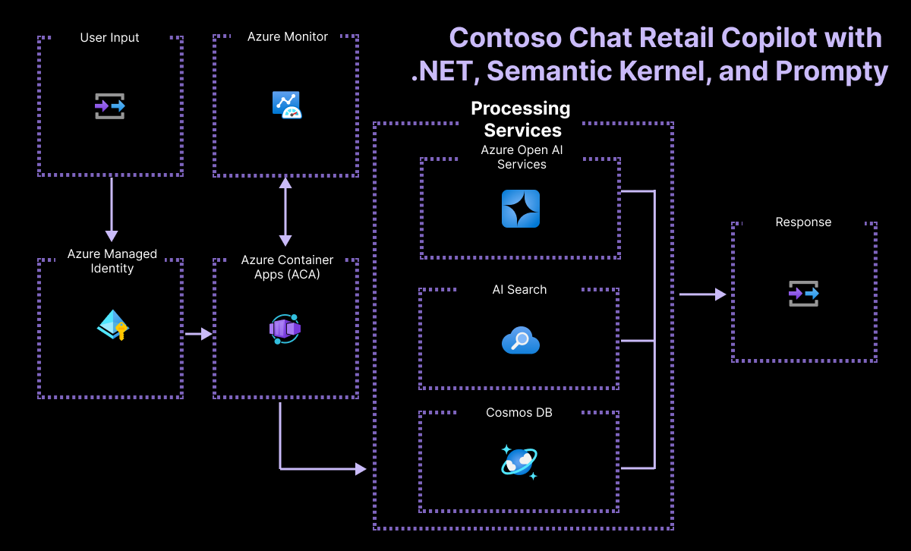

# Contoso Chat Retail with .NET and Semantic Kernel

This sample demonstrates how to build, evaluate, and deploy, a retail copilot application end-to-end using Azure AI and Cosmos DB. It's built using .NET with the Semantic Kernel library and Prompty prompt files.

---

# Table of Contents

- [What is this sample?](#what-is-this-sample)
- [Features](#features)
- [Architecture Diagram](#architecture-diagram)
- [Getting Started](#getting-started)
    - [Quickstart with Codespaces](#quickstart-with-codespaces)
- [Prerequisites](#prerequisites)
    - [Azure Account](#azure-account)
    - [AZD](#azd)
- [Deploy](#deploy)
    - [Development Enviroment](#step-1-development-environment)
    - [Create Azure Resources](#2-create-azure-resources)
    - [Running the Application](#3-running-the-application)
- [Calling the API deployed in Azure](#4-hit-the-deployed-api)
- [Guidance](#guidance)
- [Resources](#resources)
- [Troubleshooting](#troubleshooting)
- [Contributing](#contributing)

[](https://github.com/codespaces/new?hide_repo_select=true&ref=main&repo=599293758&machine=standardLinux32gb&devcontainer_path=.devcontainer%2Fdevcontainer.json&location=WestUs2)
[](https://vscode.dev/redirect?url=vscode://ms-vscode-remote.remote-containers/cloneInVolume?url=https://github.com/Azure-Samples/chat-rag-openai-csharp-prompty) 

# What is this sample?

In this sample, we present **Contoso Outdoors**, a conceptual store specializing in outdoor gear for hiking and camping enthusiasts. This virtual store enhances customer engagement and sales support through an intelligent chat agent. Artificial Intelligence is used to integrate into the customer service experience, offering responses that are not only relevant but also personalized, drawing from an extensive product catalog and individual customer purchase histories.

The sample uses the following Azure technologies:
- [Azure AI Search](https://learn.microsoft.com/azure/search/) to create and manage search indexes for product catalog data.
- [Azure Cosmos DB](https://learn.microsoft.com/azure/cosmos-db/) to store and manage customer purchase history data.
- [Azure OpenAI](https://learn.microsoft.com/azure/ai-services/openai/) to deploy and manage key models for our copilot workflow.
    - `text-embeddings-ada-002` for vectorizing user queries.
    - `gpt-35-turbo` for generating chat responses.

It exposes a REST endpoint that can be called to interact with the chat agent and is implemented using:
- [Semantic Kernel](https://learn.microsoft.com/en-us/semantic-kernel/overview/?tabs=Csharp) to access AI models, work with data stores, integrate prompts, and evaluate prompt/LLM performance.
- **Prompty** to simplify prompt creation & iteration for this copilot scenario.
- **ASP.NET Core WebAPI** to expose REST endpoints.

By exploring and deploying this sample, you will learn to:

1. Build a retail copilot application using the **RAG pattern**.
2. Ideate & iterate on application using [**Semantic Kernel**]() and **Prompty**.
3. Build & manage the solution using the **Azure AI platform & tools**.
4. Provision & deploy the solution using the [**Azure Developer CLI**](https://learn.microsoft.com/en-us/azure/developer/azure-developer-cli/overview).
5. Support **Responsible AI** practices with evaluation & content safety.

## Features

The project comes with:

* **Sample model configurations, chat and evaluation prompts** for a RAG-based copilot app.
* **Prompty assets** to simplify prompt creation & iteration for this copilot scenario.
* Sample **product and customer data** for retail application scenario
* Sample **application code** for copilot chat and evaluation workflows.
* Sample **azd-template configuration** for managing application on Azure
* **Managed Identity** configuration as a best practice for managing sensitive credentials.

The sample is also a signature application for demonstrating the new capabilities of the Azure AI platform. Expect regular updates to showcase cutting-edge features and best practices for generative AI development. 

## Architecture Diagram

The Contoso Chat application implements a _retrieval augmented generation_ pattern to ground the model responses in your data. The architecture diagram below illustrates the key components and services used for implementation and highlights the use of [Azure Managed Identity](https://learn.microsoft.com/entra/identity/managed-identities-azure-resources/) to reduce developer complexity in managing sensitive credentials.



## Getting Started

### Pre-requisites

- **Azure Subscription** - [Signup for a free account here.](https://azure.microsoft.com/free/)
- **GitHub Account** - [Signup for a free account here.](https://github.com/signup)
- **Access to Azure Open AI Services** - [Apply for access here.](https://learn.microsoft.com/legal/cognitive-services/openai/limited-access)
  - Ability to deploy these models - `gpt-35-turbo`, `text-embeddings-ada-002`
- **Ability to provision Azure AI Search (Paid)** - Required for Semantic Ranker

You will also need to validate the following requirements:
 - Access to [semantic ranker feature](https://azure.microsoft.com/explore/global-infrastructure/products-by-region/?products=search) for your search service tier and deployment region.
 - Access to [sufficient Azure OpenAI quota](https://learn.microsoft.com/azure/ai-services/openai/quotas-limits) for your selected models and deployment region.
 - Ability to provision Azure Monitor (Free tier)
 - Ability to deploy to Azure Container Apps (Free tier)
   

### Applications to install for local development (Optional)
- **Visual Studio Code** - [Download it for free here.](https://code.visualstudio.com/download)
- **Install [azd](https://aka.ms/install-azd)**
    - Windows: `winget install microsoft.azd`
    - Linux: `curl -fsSL https://aka.ms/install-azd.sh | bash`
    - MacOS: `brew tap azure/azd && brew install azd`

## Deploy

### Step 1: Development Environment

The repository is instrumented with a devcontainer.json configuration that can provide you with a pre-built environment that can be launched locally, or in the cloud. You can also elect to do a manual environment setup locally, if desired. Here are the three options in increasing order of complexity and effort on your part. 

Pick one!

- Pre-built environment, in cloud with GitHub Codespaces, described in the [Quickstart](#quickstart-with-codespaces).
- Pre-built environment, on device with Docker Desktop
- Manually setup environment, on device with .NET and NuGet installed

The first approach is recommended for minimal user effort in startup and maintenance. 
The third approach will require you to manually update or maintain your local environment, to reflect any future updates to the repo.

#### 1.1: Quickstart with Codespaces

**The recommended option!**

1. Click the green Code button on this repository.
1. Select the ``Codespaces`` tab and click ``Create codespace...`` 

    - You can also click this button: [](https://github.com/codespaces/new?hide_repo_select=true&ref=main&repo=599293758&machine=standardLinux32gb&devcontainer_path=.devcontainer%2Fdevcontainer.json&location=WestUs2)

1. This should open a new browser tab with a Codespaces container setup process running. 
1. On completion, this will launch a Visual Studio Code editor in the browser, with all relevant dependencies already installed in the running development container beneath. 

*Congratulations!* Your cloud dev environment is **ready**!

Once you've launched Codespaces you can proceed to [Deploy in Step 2](#2-create-azure-resources).

#### 1.2: Pre-Built Environment, in cloud (Docker)

This option uses the same ``devcontainer.json`` configuration, but launches the development container in your local device using Docker Desktop. 

To use this approach, you need to have the following tools pre-installed in your local device:

- Visual Studio Code (with Dev Containers Extension)
- Docker Desktop (community or free version is fine)

Make sure your Docker Desktop daemon is running on your local device. After this:

- Fork this repo to your personal profile
- Clone that fork to your local device
- Open the cloned repo using Visual Studio Code
- If your Dev Containers extension is installed correctly, you will be prompted to "*re-open the project in a container*" - just confirm to launch the container locally. 
- Alternatively, you may need to trigger this step manually. See the [Dev Containers Extension](https://marketplace.visualstudio.com/items?itemName=ms-vscode-remote.remote-containers) for more information.

Once your project launches in the local Docker desktop container, you should see the Visual Studio Code editor reflect that connection in the status bar (blue icon, bottom left). 

Congratulations! Your local dev environment is ready!

Once you've launched your docker container environment you can proceed to [step 2](#2-create-azure-resources).

#### Step 1.3: Manually Setup Environment on device

In order to run this sample locally you will need to: 

1. Clone this sample locally: 

   ``` bash
   git clone https://github.com/Azure-Samples/chat-rag-openai-csharp-prompty.git
   ```

1. Open the repo in VS Code and navigate to the src directory

   ```bash
   cd 
   code .
   cd ./src/ContosoChatAPI
   ```
1. Install the [.NET SDK](https://dotnet.microsoft.com/en-us/download/dotnet/8.0)
1. Install the newest version of [PowerShell](https://learn.microsoft.com/en-us/powershell/scripting/install/installing-powershell-on-windows?view=powershell-7.4)
    - Open PowerShell and use ``winget install --id Microsoft.Powershell --source winget``
1. Install the [C# Dev Kit](https://marketplace.visualstudio.com/items?itemName=ms-dotnettools.csdevkit) in VS Code
      - Open the VS Code Extensions tab
      - Search for "C# Dev Kit"
      - Install the extension

1. Install the [Azure CLI](https://learn.microsoft.com/cli/azure/install-azure-cli) for your device OS

## 2. Create Azure resources

We setup our development ennvironment in the previous step. In this step, we'll **provision Azure resources** for our project so they're ready to use for developing our LLM Application.


### 2.1 Authenticate with Azure

Start by connecting your Visual Studio Code environment to your Azure account:

1. Open the terminal in VS Code and use command `az login`. 
2. Complete the authentication flow. 

**If you are running within Codespaces, use these instructions to login instead:**
 1. Open the terminal in VS Code and use command `az login --use-device-code`
 2. The console message will give you an alphanumeric code
 3. Navigate to _https://microsoft.com/devicelogin_ in a new tab
 4. Enter the code from step 2 and complete the flow.

In either case, verify that the console shows a message indicating a successful authentication. Set your subscription in your enviroment with:

``az account set -s <SUB_ID>``


**Congratulations! Your VS Code session is now connected to your Azure subscription!**

### 2.2 Provision with Azure Developer CLI

For this project, we need to provision multiple Azure resources in a specific order; we'll use the [Azure Developer CLI](https://learn.microsoft.com/azure/developer/azure-developer-cli/overview) (or `azd`) to do this, following the steps below.
Visit the [azd reference](https://learn.microsoft.com/azure/developer/azure-developer-cli/reference) for more details on tool syntax, commands and options.

#### 2.2.1 Install `azd`
- If you setup your development environment manually, follow [these instructions](https://learn.microsoft.com/azure/developer/azure-developer-cli/install-azd?tabs=winget-windows%2Cbrew-mac%2Cscript-linux&pivots=os-windows) to install `azd` for your local device OS.
- If you used a pre-built dev container environment (e.g., GitHub Codespaces or Docker Desktop) the tool is pre-installed for you.
- Verify that the tool is installed by typing ```azd version``` in a terminal.

#### 2.2.2 Authenticate with Azure
- Start the authentication flow from a terminal:
    ```bash
    azd auth login
    ```
- This should activate a Device Code authentication flow as shown below. Just follow the instructions and complete the auth flow till you get the `Logged in on Azure` message indicating success.
    ```bash
    Start by copying the next code: <code-here>
    Then press enter and continue to log in from your browser...
    ```

#### 2.2.3 Provision and Deploy 

- Run the following command to provision all resources. Note: This will take awhile to complete, usually around 10-15 minutes.
    ```bash
    azd up
    ```
- During provisioning, you will be prompted for the Azure subscription you want you use and the region. You will be prompted for two different region selections: the first one is the primary location for all resources, the second is a location field specifically for where the OpenAI resource should be created.
  - At this time, we recommend using Sweden Central or East US 2 regions for OpenAI resources.
  - For Azure AI Search we recommend using the East US region, due to limited regional availability currently.

- On completion, it automatically invokes a `postprovision.sh` script, that will be located in the `infra/hooks` folder. This will attempt to log you into Azure. You may see something like this. Just follow the provided instructions to complete the authentication flow.
    ```bash
    No Azure user signed in. Please login.
    ```
- Once logged in, the script will do the following for you:
    - Create the `.azure/<env>/config.json` in the local device
    - Populate `.azure/<env>/.env` with required environment variables

That's it! You should now be ready to continue; start by completing the verification steps below and taking any troubleshooting actions identified.

#### 2.2.4 Verify Provisioning

The script will have **set up a dedicated resource group** with the required resources described earlier in the architecture section, including:

 - Cosmos DB
 - Azure OpenAI
 - Search service (Azure AI Search) resource\
 - An Azure Container Apps (ACA) resource hosting the REST endpoint

The script will set up an **Azure AI Studio** project with the following model deployments created by default, in a relevant region that supports them. _Your Azure subscription must be [enabled for Azure OpenAI access](https://learn.microsoft.com/azure/ai-services/openai/overview#how-do-i-get-access-to-azure-openai)_.
 - gpt-3.5-turbo
 - text-embeddings-ada-002

The Azure AI Search resource will have **Semantic Ranker** enabled for this project, which requires the use of a paid tier of that service. It may also be created in a different region, based on [availability of that feature](https://azure.microsoft.com/en-us/explore/global-infrastructure/products-by-region/?products=search).

### 2.3 Configure endpoints in the .NET Application

The project now needs to have access to Azure, to do this, open the ``.\src\ContosoChatAPI\ContosoChatAPI\appsettings.json`` file in your project and change the following variables. You can use the ``\.azure\<env-name>\.env`` file, generated during Azure resource provisioning, to find the correct configuration values to use.

| .env variable                | appsettings.json value |
|------------------------------|--------------------------------------------|
| APPINSIGHTS_CONNECTIONSTRING | ``ApplicationInsights -> ConnectionString``|
| AZURE_OPENAI_ENDPOINT        | ``OpenAi -> Endpoint``|
| CosmosDb__Endpoint           | ``CosmosDb -> Endpoint`` |
| AzureAISearch__Endpoint      | ``AzureAISearch -> Endpoint`` |

## 3. Running the application

In Visual Studio Code, start debugging (e.g. by pressing the F5 key) - when prompted, select C# as your language, and then choose the ContosoChatAPI project.

**If you're using GitHub Codespaces**, click to confirm when you're prompted to open a URL in the browser. Once it's open, you'll see an error - change the URL by adding "/swagger/" to the end of it and load the page.

**If you're not using GitHub Codespaces**, the browser will open to the correct URL.

## 3.1 Using the aplication with Swagger

Your browser should now be open to the Swagger UI (used for documenting and testing the Web API):


Click on the /ContosoChat API, then click the `Try it out` button and provide the following parameters:

    - customerId: `3`
    - question: `What can you tell me about jackets?`

Click the `Execute` button to send the question to the chat agent.
* An HTTP POST request will then be sent to the backend Web API.
* Semantic Kernel will then be used to query for additional context data from CosmosDB.
* A prompt, defined using the Prompty format, will be created combining the customerId, question, and context data.
* This prompt will then be sent to the Azure OpenAI service which will send back an answer to the chat.

A response will then be shown in the Swagger UI, with content similar to:

```
Answer: Sure, Michael! Let me tell you about our jackets. One of our popular jackets is the Summit Breeze Jacket (catalog id 23). It's a lightweight and windproof jacket with a water-resistant fabric. It's perfect for outdoor adventures and comes in a sleek black color. 🌬️🧥

If you're interested in jackets, you might also like the TrailWalker Hiking Shoes (catalog id 5) for a complete outdoor outfit. These shoes are rugged, waterproof, and provide excellent grip. They will keep your feet comfortable and protected during your hikes. 👟🏔️

Let me know if you need any more information!
```

## 4. Calling the API deployed in Azure

During Azure resource provisioning, an Azure Container App was deployed with the REST endpoint we just tested locally using Swagger. To call and test the deployed endpoint directly:

- Get the endpoint URL from the `.env` file that was created during provisioning.
  - Open the ``src\ContosoChatAPI\ContosoChatAPI\appsettings.json`` file in your project.
  - Copy the value of the `SERVICE_ACA_URI` variable.
- POST to the api endpoint with the `customerId` and `question`, using a tool like curl:

```
curl -v --header "Content-Type: application/json" \
  --request POST \
  --data '{"customerId":"3","question":"Tell me about your jackets?"}' \
  http://<service-aca-uri>/ContosoChat
```

## Guidance

### Region Availability

This template uses [MODEL 1] and [MODEL 2] which may not be available in all Azure regions. Check for [up-to-date region availability](https://learn.microsoft.com/azure/ai-services/openai/concepts/models#standard-deployment-model-availability) and select a region during deployment accordingly
  * We recommend using [SUGGESTED REGION]

### Costs

You can estimate the cost of this project's architecture with [Azure's pricing calculator](https://azure.microsoft.com/pricing/calculator/)

* [Azure Product] - [plan type] [link to pricing for product](https://azure.microsoft.com/pricing/)

### Security

> [!NOTE]
> When implementing this template please specify whether the template uses Managed Identity or Key Vault

This template has either [Managed Identity](https://learn.microsoft.com/entra/identity/managed-identities-azure-resources/overview) or Key Vault built in to eliminate the need for developers to manage these credentials. Applications can use managed identities to obtain Microsoft Entra tokens without having to manage any credentials. Additionally, we have added a [GitHub Action tool](https://github.com/microsoft/security-devops-action) that scans the infrastructure-as-code files and generates a report containing any detected issues. To ensure best practices in your repo we recommend anyone creating solutions based on our templates ensure that the [Github secret scanning](https://docs.github.com/code-security/secret-scanning/about-secret-scanning) setting is enabled in your repos.

## Resources

- [Take a look on more .NET AI Samples.](https://github.com/dotnet/ai-samples/)
- [Learn more .NET AI with Microsoft Learn](https://learn.microsoft.com/pt-pt/dotnet/azure/)
- [Learn Azure, deploying in GitHub!](https://github.com/Azure-Samples)

## Troubleshooting

Have questions or issues to report? Please [open a new issue](https://github.com/Azure-Samples/contoso-chat-csharp-prompty/issues) after first verifying that the same question or issue has not already been reported. If your issue has already been reported, please add any additional comments you may have, to the existing issue.

### Verifying permissions

Depending on your environment, you may see permissions errors during the provisioning of Azure resources. Here are some common permissions you will need enabled for your account:

* Your Azure account must have `Microsoft.Authorization/roleAssignments/write` permissions, such as [Role Based Access Control Administrator](https://learn.microsoft.com/azure/role-based-access-control/built-in-roles#role-based-access-control-administrator-preview), [User Access Administrator](https://learn.microsoft.com/azure/role-based-access-control/built-in-roles#user-access-administrator), or [Owner](https://learn.microsoft.com/azure/role-based-access-control/built-in-roles#owner). If you don't have subscription-level permissions, you must be granted [RBAC](https://learn.microsoft.com/azure/role-based-access-control/built-in-roles#role-based-access-control-administrator-preview) for an existing resource group and [deploy to that existing group](docs/deploy_existing.md#resource-group).
* Your Azure account also needs `Microsoft.Resources/deployments/write` permissions on the subscription level.

## Contributing

This project welcomes contributions and suggestions.  Most contributions require you to agree to a
Contributor License Agreement (CLA) declaring that you have the right to, and actually do, grant us
the rights to use your contribution. For details, visit https://cla.opensource.microsoft.com.

When you submit a pull request, a CLA bot will automatically determine whether you need to provide
a CLA and decorate the PR appropriately (e.g., status check, comment). Simply follow the instructions
provided by the bot. You will only need to do this once across all repos using our CLA.

This project has adopted the [Microsoft Open Source Code of Conduct](https://opensource.microsoft.com/codeofconduct/).

For more information see the [Code of Conduct FAQ](https://opensource.microsoft.com/codeofconduct/faq/) or
contact [opencode@microsoft.com](mailto:opencode@microsoft.com) with any additional questions or comments.

## Trademarks

This project may contain trademarks or logos for projects, products, or services. Authorized use of Microsoft 
trademarks or logos is subject to and must follow 
[Microsoft's Trademark & Brand Guidelines](https://www.microsoft.com/en-us/legal/intellectualproperty/trademarks/usage/general).

Use of Microsoft trademarks or logos in modified versions of this project must not cause confusion or imply Microsoft sponsorship.

Any use of third-party trademarks or logos are subject to those third-party's policies.
